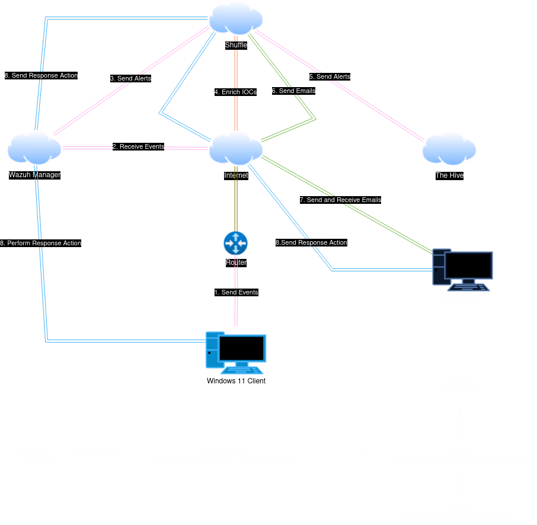

# SOC Automation Project

Welcome to the SOC (Security Operations Center) Automation project repository! This project aims to streamline security operations by automating repetitive tasks, orchestrating responses to security incidents, and enhancing overall efficiency in threat detection and response.

## Overview
Representation using draw.io:

In this project, we leverage a combination of powerful tools and platforms to create an automated SOC environment. Key components include:

- **Wazuh**: An open-source security monitoring platform used for log analysis, intrusion detection, and vulnerability detection.
- **Sysmon**: A Windows system service and device driver that logs detailed system activity to the Windows event log, enhancing visibility into system behavior.
- **TheHive**: An open-source security incident response platform that facilitates collaboration and coordination among security teams during incident investigations.
- **Shuffle**: An open-source Security Orchestration, Automation, and Response (SOAR) platform used to automate security operations tasks and workflows.
For brevity, I will only demonstrate detection of `Mimikatz` and in another case prompt to block/allow a connection from an IP address.
## Environment Setup

- **Operating System**: Windows 11
- **Security Monitoring**: `Sysmon` installed for detailed system activity logging.
- **Log Forwarding**: `Wazuh agent` deployed on Windows 11, forwarding logs to `Wazuh manager`.
- **Wazuh Manager**: Installed on Ubuntu server for centralized log analysis and security event management.
- **SOAR Platform**: Shuffle utilized for Security Orchestration, Automation, and Response.

## Getting Started

To get started with this project, follow these steps:

1. Install and configure `Sysmon` on your Windows 11 systems.
2. Deploy `Wazuh` agents on Windows 11 endpoints to forward logs to the centralized `Wazuh manager`.
3. Set up the `Wazuh` manager on an Ubuntu server for centralized log analysis.
4. Integrate TheHive with `Wazuh` for incident response and case management.
5. Install and configure Shuffle as the SOAR platform for automation and orchestration.

For detailed installation and configuration instructions, please refer to the [Documentation](/docs).

## Usage

Once the environment is set up, you can:

- Monitor system activity using `Wazuh` and `Sysmon`.
- Respond to security incidents using TheHive for case management and investigation.
- Automate security operations tasks using Shuffle for orchestration and automation.

For usage examples and workflows, please refer to the [Usage Guide](/docs/usage.md).

## Acknowledgments

I would like to thank [Mydfir](https://www.youtube.com/@MyDFIR) for his valuable contribution without his help it wouldn't have been possible to complete this project.
