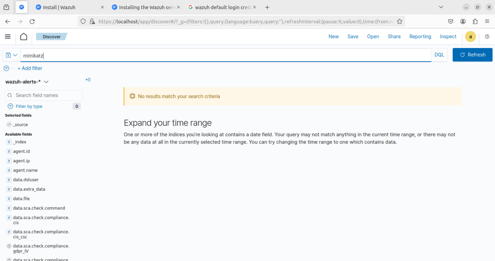
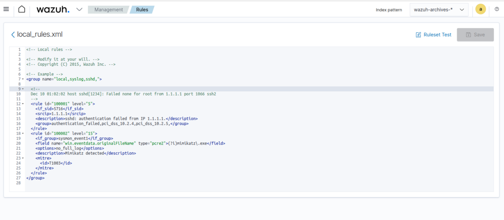
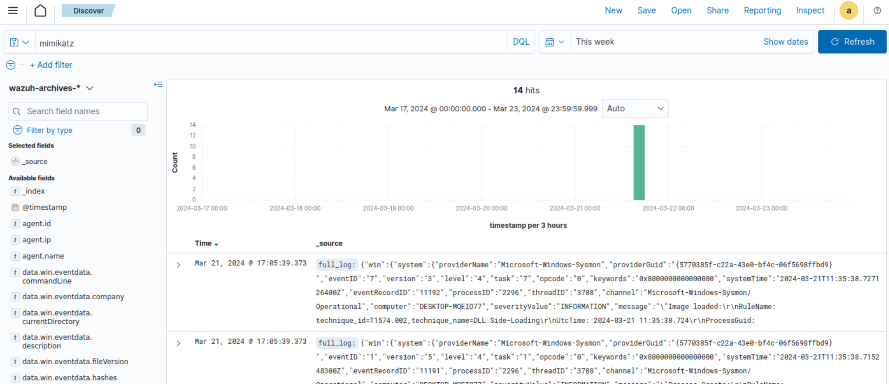
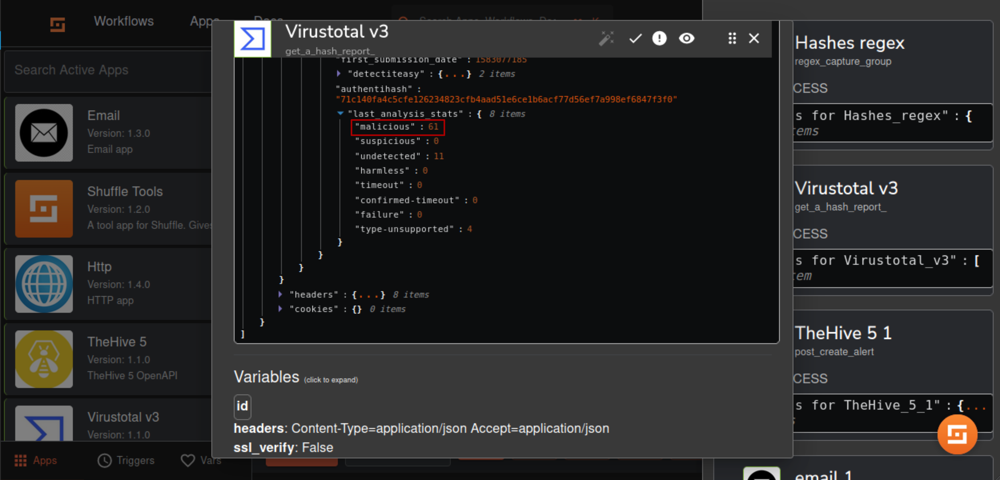
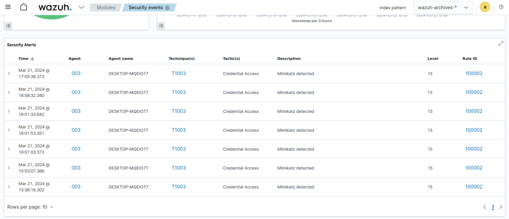
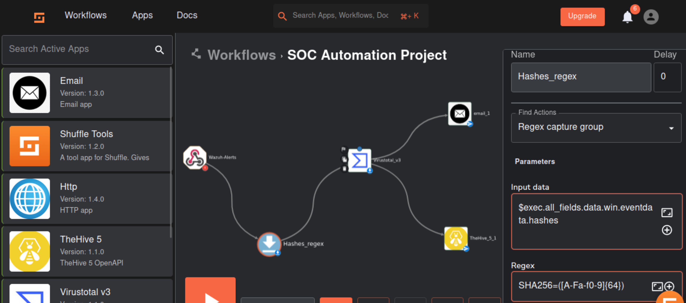
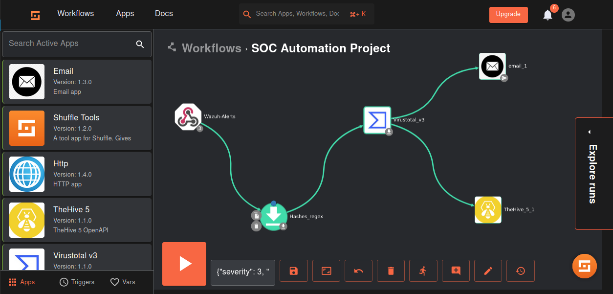
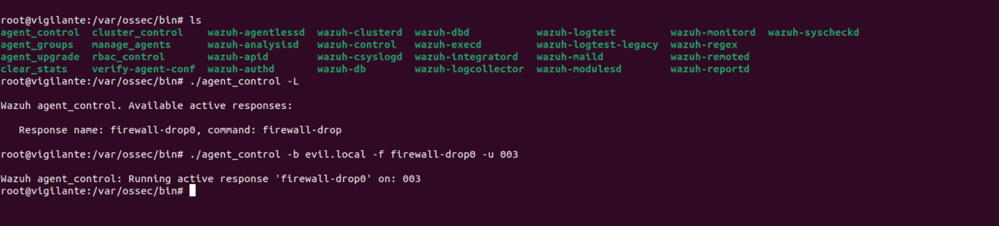
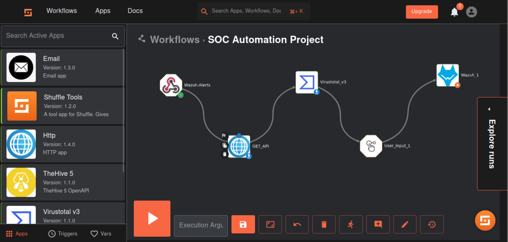

1. **Windows 11 Sends Events**: Windows 11 endpoints generate security-related events using tools like Sysmon. These events can include process creations, network connections, file modifications, and other system activities that may indicate potential security threats.
In this case I'm running `mimikatz` to showcase the malicious binary execution and `sysymon` is installed so the configuration required in it's conf file and  `ossec.conf` file are  attached here with fie names `sysmon.cnf` `wazuh-agent-ossec.conf`. ( These files can be downloaded from there github repos, there is no change in sysmon configuration file but wazuh-agent configuration has some changes to make logs more relevant) 

2. **Trigger Alerts and Perform Response Actions**: The events generated by Windows 11 endpoints are monitored by Wazuh agents installed on these systems. Wazuh is configured to analyze the incoming events in real-time and trigger alerts based on predefined rules and policies. When a security event meets certain criteria, Wazuh initiates response actions to mitigate the threat, such as blocking malicious processes, isolating endpoints, or generating incident tickets.
In this case `wazuh-manager` is installed in `Ubuntu` and configure as need (`wazuh-manager-ossec.conf`) for logs and integrations.

3. **Shuffle Receives Alerts and Sends Responsive Actions**: Shuffle, the SOAR platform, acts as a central orchestrator for handling security alerts and automating response actions. It integrates with Wazuh to receive alerts and event data in real-time. Shuffle then processes these alerts using predefined playbooks and workflows to perform automated response actions.

4. **OSINT Enrichment**: Upon receiving security alerts, Shuffle may perform enrichment tasks using Open Source Intelligence (OSINT) sources. This involves gathering additional context and information about the detected indicators of compromise (IOCs), such as IP addresses, domain names, or file hashes. OSINT enrichment helps in better understanding the nature and severity of security threats.

5. **TheHive Integration - Create Alert in Case Management**: After enrichment, Shuffle integrates with TheHive, the security incident response platform. It creates alerts or incidents in TheHive's case management system, providing detailed information about the security event, enriched IOCs, and any automated response actions taken. TheHive serves as a central repository for managing and tracking security incidents, allowing security analysts to investigate, prioritize, and respond to threats effectively.

Now let's discuss the two scenarios:
**First Scenario:** 
In this case we use `mimikatz` as a malicious executable in windows, when executed the event will be forwarded from `Wazuh` through `Shuffle` to `Virustotal` but in between the hash (SHA-256) of the malicious executable is strip out using regex and `Virustotal` check for it's reputation and result will be forwarded to emails and `TheHive` which are configured with custom response using `Shuffle`. These steps require lots of configurations like adding custom rules in `wazuh-manager` for detection of `mimikatz` (Mitre T1003 aka Credential dumping) and setting `Wazuh-manager` logs format as well as index-pattern.
mimikatz not detected before rule configuration:

Custom rule:

mimikatz detected after configuring rule:

Virus total report: around 61 vendors reported the file as malicious:

Custom rule events:

Regex used:

Shuffle Workspace:

**Second Scenario:**In this case we will send prompt to user/soc analyst through mail  whether to allow or block the access from an IP address using `Wazuh API`, `Http app` and `User-Input` then response from user/soc analyst will be forwarded to `Wazuh` and the required action will be taken. These steps are not that much easy and required lots of configuration. Documentation is available for all the steps so no need to worry. And for active response we have to add the required entries in `ossec.conf` file under `active-response` section

Agent Control:

Shuffle Workspace:

